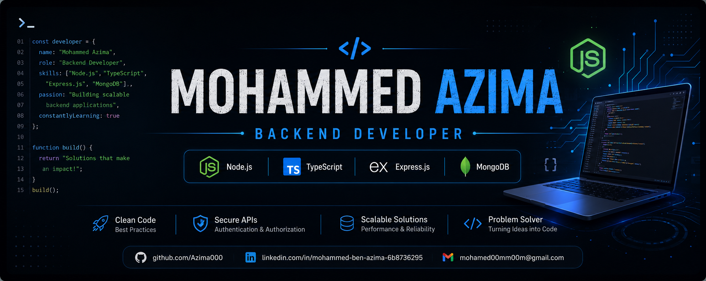

<p align="center">
  
</p>

<h1 align="center">Hi 👋, I'm Mohammed "Azima"</h1>

<h3 align="center">
Backend Developer • Node.js • TypeScript • Express.js • MongoDB
</h3>

<p align="center">
  
</p>

<p align="center">
Computer Science Student from Egypt 🇪🇬 <br>
Passionate about Backend Development, REST APIs, Databases, and Software Engineering.
</p>

<p align="center">
<a href="https://github.com/Azima000">

</a>

<a href="https://www.linkedin.com/in/mohammed-ben-azima-6b8736295">

</a>

<a href="mailto:mohamed00mm00m@gmail.com">

</a>
</p>

<p align="center">

</p>

---

# ⚡ About Me

- 🔭 Building Backend Applications with **Node.js**
- 🌱 Currently learning **Redis**, **Docker**, **System Design**, and **Clean Architecture**
- 💻 Passionate about **Backend Development**, **REST APIs**, and scalable applications
- 🏆 Participated in the **CPC Programming Contest**
- 🎯 Looking for Backend Developer opportunities
- 🚀 Always learning and improving

---

# 💻 A Little More About Me

```javascript
const azima = {
  name: "Mohammed Abdalazim",

  nickname: "Azima",

  role: "Backend Developer",

  location: "Sharqia, Egypt",

  education: "Computer Science Student",

  languages: [
    "C++",
    "JavaScript",
    "TypeScript",
    "SQL"
  ],

  backend: [
    "Node.js",
    "Express.js",
    "REST APIs",
    "JWT Authentication",
    "Authentication & Authorization",
    "Google OAuth",
    "MVC Architecture",
    "File Upload",
    "Email Verification"
  ],

  databases: [
    "MongoDB",
    "Mongoose",
    "MySQL"
  ],

  tools: [
    "Git",
    "GitHub",
    "VS Code",
    "Postman",
    "Thunder Client",
    "npm"
  ],

  concepts: [
    "OOP",
    "Data Structures",
    "Algorithms",
    "Async Programming",
    "Error Handling",
    "Environment Variables"
  ],

  currentlyLearning: [
    "Redis",
    "Docker",
    "System Design",
    "Clean Architecture"
  ],

  currentFocus: "Building scalable backend applications."
};
```

---

# 🛠 Tech Stack

### 💻 Languages


### ⚙️ Backend


### 🗄 Database


### 🛠 Tools


### 📚 Currently Learning


---

# 🚀 Featured Projects

> 💡 These are some of the backend projects I've built and continue improving.

### 🔐 Authentication API
- JWT Authentication
- Refresh Tokens
- Email Verification
- Role-Based Authorization
- Secure Password Hashing

### 📚 Book Store Backend API
- CRUD Operations
- Authentication
- File Upload
- Search & Filtering

### 📝 Task Management API
- User Authentication
- Task CRUD
- Validation
- Clean Architecture

### 🛒 E-Commerce Backend API *(Coming Soon)*
- Shopping Cart
- Payment Integration
- Orders
- Product Management

---

# 📈 GitHub Activity

<p align="center">

</p>

---

# 📊 GitHub Stats

<p align="center">


</p>

---

# 🔥 GitHub Streak

<p align="center">

</p>

---

# 🏆 GitHub Trophies

<p align="center">

</p>

---

# 📌 Current Goals

- 🚀 Master Node.js Backend Development
- 🐳 Learn Docker & Containerization
- ⚡ Learn Redis for Caching
- 🏗️ Master System Design
- ☁️ Deploy scalable backend applications
- 💼 Get my first Backend Developer internship

---

# 📂 Featured Technologies

<p align="center">


</p>

---
# 💬 Random Dev Quote

<p align="center">

</p>

---

# 📫 Connect With Me

<p align="center">

<a href="mailto:mohamed00mm00m@gmail.com">

</a>

<a href="https://www.linkedin.com/in/mohammed-ben-azima-6b8736295">

</a>

<a href="https://github.com/Azima000">

</a>

</p>

---

# 📈 Profile Summary

<p align="center">

</p>

<p align="center">


</p>

<p align="center">


</p>

---

# 🐍 Contribution Snake

<p align="center">

</p>

> **Note:** The snake animation requires a GitHub Action to generate it automatically.

---

# 👀 Visitor Counter

<p align="center">

</p>

---

<h2 align="center">💙 Thanks for Visiting My Profile!</h2>

<p align="center">

If you like my work, consider giving ⭐ to my repositories.

I'm always open to collaborating on **Backend**, **Node.js**, and **Open Source** projects.

</p>

<p align="center">

### 🚀 Keep Learning • Keep Building • Keep Growing

</p>
